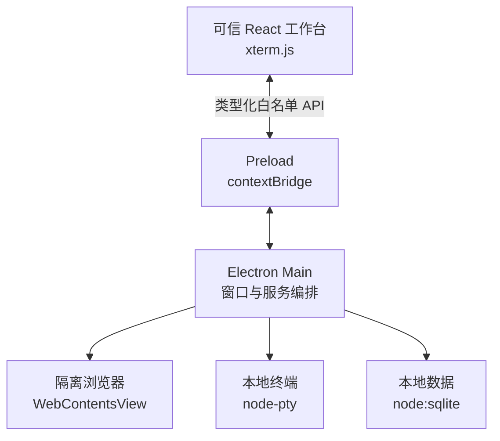

# Daily Workbench

一个面向个人日常工作的 Electron 桌面工作台。它借鉴 Codex 一类“上下文 + 工具面板”的交互方式，把今日事项、项目、网页与终端放进同一个可恢复的工作空间。

> 当前状态：`v0.3` 个人任务闭环。Electron 进程隔离、真实工具面板、可迁移数据库、工作区、收件箱、任务与今日计划已经打通；笔记模块仍为界面原型，日程尚未接入真实数据或界面。

## 已具备的能力

- 类桌面 IDE 的活动栏、工作区侧栏、中央仪表盘、右侧浏览器和底部终端
- 可创建、重命名、切换和安全归档的真实 SQLite 工作区
- 按工作区恢复页面、主题、侧栏以及浏览器/终端面板开关和尺寸
- 任意页面可用的 `Ctrl/Cmd + N` 快速记录，以及按工作区隔离的真实 SQLite 收件箱
- 收件箱搜索、受控分类、软归档和 Main 签发的一次性短期撤销
- 按工作区隔离的真实 SQLite 任务，可创建、重命名、更新状态并加入或移出今日计划
- Today 的任务列表、完成进度与状态操作使用真实任务数据；笔记模块仍为界面原型，日程尚未接入真实数据或界面
- 将收件箱线索原子转换为带唯一来源关系的任务，失败时不会留下半完成状态
- 命令面板及常用键盘快捷键
- 独立 `WebContentsView` 浏览器，支持地址跳转、前进、后退、刷新和加载状态
- 基于 `xterm.js` + `node-pty` 的真实本地终端
- 适配 Windows 的 PowerShell/CMD 扩展路径，并兼容 macOS/Linux 默认 shell
- 严格的 preload 白名单 API、IPC 参数校验、远程网页隔离与权限默认拒绝
- TypeScript、ESLint、Prettier、Vitest 和 GitHub Actions 基础质量链路
- Electron Forge Windows x64 Squirrel 制品，以及同一 make 作业未打包负载的 ConPTY 与业务数据冒烟测试
- 完整依赖审计报告、开发期风险基线和打包后 Electron fuse 状态校验
- Electron 内置 `node:sqlite` 数据库、事务迁移、迁移校验和与迁移前自动备份
- 受控手动备份 API，以及 Linux/Windows 打包后 SQLite、工作区、收件箱、任务、迁移、备份和重开验证

## 快速开始

### 环境要求

- Node.js 24.14.0（见 `.nvmrc`）
- npm 11.9.0
- Windows 10 1809 或更新版本（使用 ConPTY）；Windows 10 22H2 可直接使用

`node-pty` 是原生模块。如果本机没有匹配的预编译包，Windows 还需要 Visual Studio 2022 的“使用 C++ 的桌面开发”、Windows SDK 与 Python 3。

```bash
git clone https://github.com/Oracle0703/code.git
cd code
nvm use
npm ci
npm start
```

常用质量命令：

```bash
npm run lint
npm run typecheck
npm test
npm run audit:all
npm run package
```

运行全部检查：

```bash
npm run check
```

`npm run audit:all` 会把完整报告写入 `reports/npm-audit.json`，并阻止未审查、已过期或进入生产依赖的漏洞。当前 Forge 构建链中的受控例外和复查期限见[依赖风险说明](docs/DEPENDENCY_RISKS.md)。

## 构建支持矩阵

| 目标            | 当前验证级别                                                       |
| --------------- | ------------------------------------------------------------------ |
| Windows x64     | Squirrel 构建及其未打包负载的原生文件、fuse、ConPTY 与业务数据冒烟 |
| Linux x64       | Electron package、fuse、包体、终端与业务数据冒烟                   |
| macOS x64/arm64 | 已配置 ZIP maker，尚未进入 CI 实机验证                             |

GitHub Actions 的 Windows 作业会保存通过该作业内全部检查的安装包、完整 NuGet 更新包、`RELEASES` 和 `SHA256SUMS.txt`，保留 14 天。当前运行时冒烟针对 Squirrel 构建同时产生的未打包应用负载；最终 NUPKG 负载复验仍由独立的 Issue #9 跟踪。

## 快捷键

| 快捷键                 | 功能             |
| ---------------------- | ---------------- |
| `Ctrl/Cmd + K`         | 打开命令面板     |
| `Ctrl/Cmd + B`         | 折叠或展开左侧栏 |
| `Ctrl/Cmd + Shift + B` | 显示或隐藏浏览器 |
| `Ctrl/Cmd + J`         | 显示或隐藏终端   |
| `Ctrl/Cmd + N`         | 快速记录入口     |
| `Escape`               | 关闭当前浮层     |

## 工程结构

```text
src/
├─ main/            Electron 生命周期、数据库、窗口、浏览器、终端与 IPC
├─ preload/         contextBridge 暴露的最小可信 API
├─ renderer/        React 工作台界面与 xterm.js
├─ shared/          主进程与渲染进程共享的类型、协议和纯函数
└─ types/           Electron/Vite 全局类型声明
tests/              可在普通 Node 环境运行的单元测试
docs/               架构、安全边界与后续演进说明
migrations/         只追加的 SQLite 迁移
```



浏览器网页与本地 React 界面不共享 `WebContents`。远程网页没有 preload、不能访问 Node.js，并使用独立持久化会话。更详细的设计见[架构说明](docs/ARCHITECTURE.md)和[数据库与迁移](docs/DATABASE.md)。

## 开发路线

1. Markdown 笔记闭环与真实今日日程
2. 浏览器多标签、收藏夹和下载管理
3. PowerShell、CMD、WSL 多终端配置
4. 全局搜索、快捷动作、导入导出和定时备份
5. 定时自动化与 Codex/AI 能力接入

当前工作区只隔离导航与界面布局。浏览器 URL/历史/session，以及终端进程、Shell、CWD 和缓冲区仍是应用级工具上下文，将在后续工具上下文阶段接入工作区。

## 许可证

[MIT](LICENSE)
