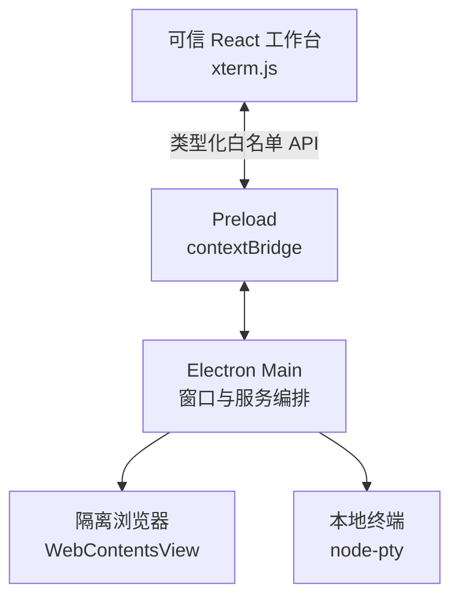

# Daily Workbench

一个面向个人日常工作的 Electron 桌面工作台。它借鉴 Codex 一类“上下文 + 工具面板”的交互方式，把今日事项、项目、网页与终端放进同一个可恢复的工作空间。

> 当前状态：`v0.1` 基础框架。首个版本重点打通安全的 Electron 进程模型、右侧真实浏览器和底部真实终端，为后续任务、笔记、自动化与 AI 模块保留清晰边界。

## 已具备的能力

- 类桌面 IDE 的活动栏、工作区侧栏、中央仪表盘、右侧浏览器和底部终端
- 可调整并持久化的侧栏、浏览器和终端尺寸
- 命令面板及常用键盘快捷键
- 独立 `WebContentsView` 浏览器，支持地址跳转、前进、后退、刷新和加载状态
- 基于 `xterm.js` + `node-pty` 的真实本地终端
- 适配 Windows 的 PowerShell/CMD 扩展路径，并兼容 macOS/Linux 默认 shell
- 严格的 preload 白名单 API、IPC 参数校验、远程网页隔离与权限默认拒绝
- TypeScript、ESLint、Prettier、Vitest 和 GitHub Actions 基础质量链路
- Electron Forge 打包，以及 Windows/macOS/Linux maker 配置

## 快速开始

### 环境要求

- Node.js 24+
- npm 10+
- Windows 10 1809 或更新版本（使用 ConPTY）；Windows 10 22H2 可直接使用

`node-pty` 是原生模块。如果本机没有匹配的预编译包，Windows 还需要 Visual Studio 2022 的“使用 C++ 的桌面开发”、Windows SDK 与 Python 3。

```bash
git clone https://github.com/Oracle0703/code.git
cd code
npm install
npm start
```

常用质量命令：

```bash
npm run lint
npm run typecheck
npm test
npm run package
```

运行全部检查：

```bash
npm run check
```

## 快捷键

| 快捷键                 | 功能             |
| ---------------------- | ---------------- |
| `Ctrl/Cmd + K`         | 打开命令面板     |
| `Ctrl/Cmd + B`         | 折叠或展开左侧栏 |
| `Ctrl/Cmd + Shift + B` | 显示或隐藏浏览器 |
| `Ctrl/Cmd + J`         | 显示或隐藏终端   |
| `Ctrl/Cmd + N`         | 快速记录入口     |
| `Escape`               | 关闭当前浮层     |

## 工程结构

```text
src/
├─ main/            Electron 生命周期、窗口、浏览器、终端与 IPC
├─ preload/         contextBridge 暴露的最小可信 API
├─ renderer/        React 工作台界面与 xterm.js
├─ shared/          主进程与渲染进程共享的类型、协议和纯函数
└─ types/           Electron/Vite 全局类型声明
tests/              可在普通 Node 环境运行的单元测试
docs/               架构、安全边界与后续演进说明
```



浏览器网页与本地 React 界面不共享 `WebContents`。远程网页没有 preload、不能访问 Node.js，并使用独立持久化会话。更详细的设计见 [架构说明](docs/ARCHITECTURE.md)。

## 开发路线

1. 工作区、任务、收件箱和 Markdown 笔记的数据层
2. 浏览器多标签、收藏夹和下载管理
3. PowerShell、CMD、WSL 多终端配置
4. 全局搜索、快捷动作、导入导出和自动备份
5. 定时自动化与 Codex/AI 能力接入

## 许可证

[MIT](LICENSE)
