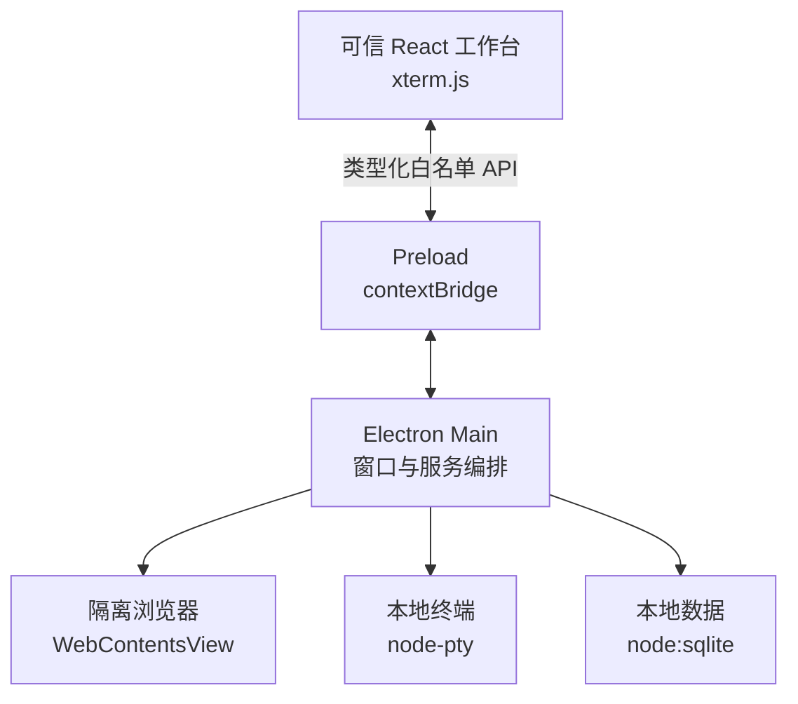

# Daily Workbench

一个面向个人日常工作的 Electron 桌面工作台。它借鉴 Codex 一类“上下文 + 工具面板”的交互方式，把今日事项、项目、网页与终端放进同一个可恢复的工作空间。

> 当前状态：`v0.8` 本机终端配置闭环。Electron 进程隔离、可迁移数据库、浏览器标签/收藏夹/安全下载、工作区隔离的多终端、全局搜索与受控数据可移植性已经打通；每个工作区还可安全保存固定 Profile、本机启动目录与受控 WSL 发行版选择。

## 已具备的能力

- 类桌面 IDE 的活动栏、工作区侧栏、中央仪表盘、右侧浏览器和底部终端
- 可创建、重命名、切换和安全归档的真实 SQLite 工作区
- 按工作区恢复页面、主题、侧栏以及浏览器/终端面板开关和尺寸
- 任意页面可用的 `Ctrl/Cmd + N` 快速记录，以及按工作区隔离的真实 SQLite 收件箱
- 收件箱搜索、受控分类、软归档和 Main 签发的一次性短期撤销
- 按工作区隔离的真实 SQLite 任务，可创建、重命名、更新状态并加入或移出今日计划
- 按工作区隔离的 Markdown 笔记，可创建、编辑、搜索、软归档，并用 revision 防止迟到保存覆盖新内容
- 将收件箱中的笔记线索原子转换为带唯一来源关系的真实笔记
- 按工作区隔离的今日日程，可创建、编辑和软归档专注、会议、回顾与个人时间段
- Today 同时使用真实任务和真实日程，并在跨午夜、窗口恢复或重新聚焦后刷新本地日期
- 将收件箱线索原子转换为带唯一来源关系的任务，失败时不会留下半完成状态
- 合并命令面板的全局搜索，可跨当前或全部活动工作区定位收件箱、任务、笔记、日程、浏览器标签和收藏夹
- 命令面板中的工作区切换、页面导航、快速记录、浏览器、终端配置和数据设置快捷动作
- 按工作区持久化的多标签浏览器与收藏夹，支持地址跳转、前进、后退、刷新、停止和完整键盘导航
- Main 独占的安全下载管理，使用系统保存对话框并支持暂停、恢复、取消、清理记录和定位已完成文件
- 基于 `xterm.js` + `node-pty` 的工作区多终端标签，支持独立缓冲区、激活、重启、清空和关闭
- 由 Main 探测并启动固定 Shell Profile：Windows PowerShell 7、Windows PowerShell、CMD、受控 WSL，以及 macOS/Linux 默认 shell、Bash、Zsh 或 PowerShell 7
- 按工作区保存本机终端 Profile、由原生目录选择器授权的启动目录，以及能力快照绑定的 WSL 发行版；新设置只影响之后创建的会话
- 严格的 preload 白名单 API、IPC 参数校验、远程网页隔离与权限默认拒绝
- TypeScript、ESLint、Prettier、Vitest 和 GitHub Actions 基础质量链路
- Electron Forge Windows x64 Squirrel 制品，以及同一 make 作业未打包负载的 ConPTY 与业务数据冒烟测试
- 完整依赖审计报告、开发期风险基线和打包后 Electron fuse 状态校验
- Electron 内置 `node:sqlite` 数据库、事务迁移、迁移校验和与迁移前自动备份
- 受控手动备份、每日/每周定时备份、只清理定时快照的保留策略和持久化失败退避
- Main 独占的 `.dwbx` 逻辑导出/预检导入与崩溃可恢复替换，不接受 Renderer 路径或外部 SQLite，也不携带机器相关的终端配置
- Linux/Windows 打包后 SQLite、工作区、收件箱、任务、笔记、日程、浏览器、搜索、终端配置、迁移、备份和重开验证

## 快速开始

### 环境要求

- Node.js 24.14.0（见 `.nvmrc`）
- npm 11.9.0
- Windows 10 1809 或更新版本（使用 ConPTY）；Windows 10 22H2 可直接使用

`node-pty` 是原生模块。如果本机没有匹配的预编译包，Windows 还需要 Visual Studio 2022 的“使用 C++ 的桌面开发”、Windows SDK 与 Python 3。

```bash
git clone https://github.com/Oracle0703/code.git
cd code
nvm use
npm ci
npm start
```

常用质量命令：

```bash
npm run lint
npm run typecheck
npm test
npm run test:terminal
npm run audit:all
npm run build:database-smoke
npm run build:electron-download-smoke
npm run build:terminal-manager-smoke
npm run smoke:electron-downloads
npm run package
```

真实下载冒烟需要图形会话。Linux CI 会在 Xvfb 中运行固定的 Electron 43.2.0；Windows CI 直接运行依赖中固定的 `electron.exe`。

运行全部检查：

```bash
npm run check
```

`npm run audit:all` 会把完整报告写入 `reports/npm-audit.json`，并阻止未审查、已过期或进入生产依赖的漏洞。当前 Forge 构建链中的受控例外和复查期限见[依赖风险说明](docs/DEPENDENCY_RISKS.md)。

## 构建支持矩阵

| 目标            | 当前验证级别                                                 |
| --------------- | ------------------------------------------------------------ |
| Windows x64     | Squirrel、fuse、ConPTY、多终端、业务数据及真实下载冒烟       |
| Linux x64       | Electron package、fuse、包体、多终端、业务数据及真实下载冒烟 |
| macOS x64/arm64 | 已配置 ZIP maker，尚未进入 CI 实机验证                       |

GitHub Actions 的 Windows 作业会保存通过该作业内全部检查的安装包、完整 NuGet 更新包、`RELEASES` 和 `SHA256SUMS.txt`，保留 14 天。当前运行时冒烟针对 Squirrel 构建同时产生的未打包应用负载；最终 NUPKG 负载复验仍由独立的 Issue #9 跟踪。

## 快捷键

| 快捷键                 | 功能                                   |
| ---------------------- | -------------------------------------- |
| `Ctrl/Cmd + K`         | 打开全局搜索与命令面板                 |
| `Ctrl/Cmd + B`         | 折叠或展开左侧栏                       |
| `Ctrl/Cmd + Shift + B` | 显示或隐藏浏览器                       |
| `Ctrl/Cmd + J`         | 显示或隐藏终端                         |
| `Ctrl/Cmd + N`         | 快速记录入口                           |
| `Ctrl/Cmd + L`         | 聚焦浏览器地址栏                       |
| `Ctrl/Cmd + T`         | 新建浏览器标签                         |
| `Ctrl/Cmd + W`         | 关闭当前浏览器标签                     |
| `Ctrl/Cmd + R`         | 刷新当前网页                           |
| `Ctrl/Cmd + D`         | 收藏或取消收藏当前网页                 |
| `Ctrl + Tab`           | 切换到下一个浏览器标签                 |
| `Ctrl + Shift + Tab`   | 切换到上一个浏览器标签                 |
| `Alt + ← / →`          | 浏览器后退或前进                       |
| `Escape`               | 停止正在加载的网页，或关闭当前 UI 浮层 |

## 工程结构

```text
src/
├─ main/            Electron 生命周期、数据库、窗口、浏览器、终端与 IPC
├─ preload/         contextBridge 暴露的最小可信 API
├─ renderer/        React 工作台界面与 xterm.js
├─ shared/          主进程与渲染进程共享的类型、协议和纯函数
└─ types/           Electron/Vite 全局类型声明
tests/              可在普通 Node 环境运行的单元测试
docs/               架构、安全边界与后续演进说明
migrations/         只追加的 SQLite 迁移
```



浏览器网页与本地 React 界面不共享 `WebContents`。远程网页没有 preload、不能访问 Node.js，并使用独立持久化会话。更详细的设计见[架构说明](docs/ARCHITECTURE.md)和[数据库与迁移](docs/DATABASE.md)。

## 开发路线

1. 定时自动化
2. Codex/AI 能力接入

浏览器标签与收藏夹已按工作区隔离；切换工作区会销毁旧的远程页面运行时，并按需恢复新工作区的活动标签。Cookie、登录态和浏览器持久会话仍为应用级共享上下文，下载列表仅保留在本次运行中。终端会话和缓冲区同样只存在于本次运行，但严格归属于创建它们的工作区：切换工作区会保留后台会话，归档工作区会终止其全部 PTY，退出应用会清理所有会话。每个工作区的 Profile、本机启动目录和 WSL 发行版选择会保存在本机 SQLite 中，但不进入可移植 `.dwbx`；既有会话冻结创建时的启动描述，新设置只作用于新会话。Renderer 不能提交路径、发行版名称、可执行文件、参数或环境变量；WSL 始终从系统默认或显式选择的发行版 Linux home 启动，本阶段不提供任意 Linux CWD、安装、更新或管理命令。

## 许可证

[MIT](LICENSE)
