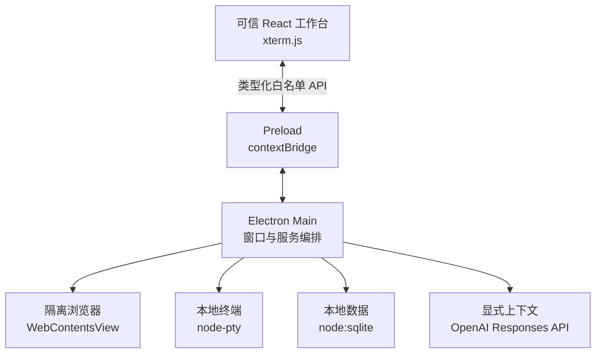

# Daily Workbench

一个面向个人日常工作的 Electron 桌面工作台。它借鉴 Codex 一类“上下文 + 工具面板”的交互方式，把今日事项、项目、网页与终端放进同一个可恢复的工作空间。

> 当前状态：应用备份时间点恢复闭环。Electron 进程隔离、schema v11 可迁移数据库、浏览器标签/收藏夹/安全下载、工作区隔离的多终端、滚动 7 日计划、全局搜索、受控数据可移植性、每日/每周固定自动化及显式确认的立即运行、只读工作区 AI 助手，以及可从今日任务直达确认的可恢复专注会话已经打通；设置页现在可查看完整的应用备份历史，并以 Main 权威的安全替换流程恢复到所选时间点。

## 已具备的能力

- 类桌面 IDE 的活动栏、工作区侧栏、中央仪表盘、右侧浏览器和底部终端
- 可创建、重命名、切换、安全归档并以 revision CAS 恢复的真实 SQLite 工作区；名称冲突必须显式改名，恢复不会自动切换当前工作区
- 按工作区恢复页面、主题、侧栏以及浏览器/终端面板开关和尺寸；偏好写入按字段与请求身份有序保存，迟到回执不会误清当前修改
- 任意页面可用的 `Ctrl/Cmd + N` 快速记录，以及按工作区隔离的真实 SQLite 收件箱；成功后留在原页，并可从统一回执显式打开 Main 返回的精确记录；已落库但暂未同步时会安全提示重新读取且不要重复添加
- 收件箱搜索、受控分类、软归档和 Main 签发的一次性短期撤销
- 按工作区隔离的真实 SQLite 任务，可创建、重命名、更新状态，并在 Main 定义的接下来 7 天内安排、移动或移出计划；从 Today、Tasks 或命令面板手动创建成功后留在原页，并可从回执显式打开 Main 返回的精确任务
- 按工作区隔离的 Markdown 笔记，可创建、编辑、搜索、软归档，并用 revision 防止迟到保存覆盖新内容
- 将收件箱中的笔记线索原子转换为带唯一来源关系的真实笔记；成功后留在 Inbox，并只在用户显式确认后打开 Main 返回的精确笔记
- 按工作区隔离的 7 日日程，可在当前滚动窗口内创建、编辑和软归档专注、会议、回顾与个人时间段；手动创建成功后留在 Today，并可从回执显式编辑 Main 返回的精确日程
- Today 保留严格的今日任务、今日日程与专注语义，同时提供任务/日程共用的 7 日计划视图；跨日未完成任务会独立进入“待重新安排”，只有用户显式完成、移到 Main 签发的日期或移出计划后才更新，不会自动顺延或混入今日进度
- Today 与任务页可从符合条件的今日未完成任务打开同一个固定 25 分钟确认窗口，也可在 Today 开始自由专注；暂停、继续、取消、休眠恢复、重启对账和今日完成轮次均由 Main/SQLite 管理，关联轮次完成后只提供由用户显式确认的精确任务收尾
- 将收件箱线索原子转换为带唯一来源关系的任务，失败时不会留下半完成状态；成功后留在 Inbox，并只在用户显式确认后打开 Main 返回的精确任务
- 合并命令面板的全局搜索，可跨当前或全部活动工作区定位收件箱、任务、笔记、滚动 7 日内的日程、浏览器标签和收藏夹
- 命令面板中的工作区切换、页面导航、快速记录、浏览器、终端配置和数据设置快捷动作
- 按工作区持久化的多标签浏览器与收藏夹，支持地址跳转、前进、后退、刷新、停止和完整键盘导航
- Main 独占的安全下载管理，使用系统保存对话框并支持暂停、恢复、取消、清理记录和定位已完成文件
- 基于 `xterm.js` + `node-pty` 的工作区多终端标签，支持独立缓冲区、激活、重启、清空和关闭
- 由 Main 探测并启动固定 Shell Profile：Windows PowerShell 7、Windows PowerShell、CMD、受控 WSL，以及 macOS/Linux 默认 shell、Bash、Zsh 或 PowerShell 7
- 按工作区保存本机终端 Profile、由原生目录选择器授权的启动目录，以及能力快照绑定的 WSL 发行版；新设置只影响之后创建的会话
- 按工作区保存默认停用的每日/每周自动化，只能创建今日任务或静态 Markdown 笔记；手动创建成功后留在原页，并可从回执显式打开 Main 返回的精确规则；应用重启后最多补执行最近一次错过的计划，也可在展示已保存动作并获得显式确认后立即运行一次，确认精确输出已同步后再从成功反馈显式打开
- 只在用户显式发起时读取 Today、选中的未完成任务或一篇已保存笔记，经固定的 OpenAI Responses API 生成流式回答；完整回答保存为笔记后仍停留在 AI 页，并只在用户显式确认后打开 Main 返回的精确笔记
- 严格的 preload 白名单 API、IPC 参数校验、远程网页隔离与权限默认拒绝
- TypeScript、ESLint、Prettier、Vitest 和 GitHub Actions 基础质量链路
- Electron Forge Windows x64 Squirrel 制品，以及同一 make 作业未打包负载的 ConPTY 与业务数据冒烟测试
- 完整依赖审计报告、开发期风险基线和打包后 Electron fuse 状态校验
- Electron 内置 `node:sqlite` 数据库、事务迁移、迁移校验和与迁移前自动备份
- 受控手动备份、每日/每周定时备份、只清理定时快照的保留策略和持久化失败退避
- 应用生成备份的完整历史与安全时间点恢复；目标由严格元数据令牌锁定，旧 schema 先在副本上升级到 v11，恢复前保留当前库安全备份并通过 crash marker 重启替换
- Main 独占的 `.dwbx` v3 逻辑导出/预检导入与崩溃可恢复替换，不接受 Renderer 路径或外部 SQLite；source schema v10/v11 共用 v3，所有来源都构建 schema v11 staging，自动化定义和未结束专注导入后强制暂停
- Linux/Windows 打包后 SQLite、工作区、收件箱、任务、笔记、日程、专注、浏览器、搜索、终端配置、自动化、迁移、备份恢复和重开验证
- 不使用真实 API key 或外网的本地 Responses SSE provider 冒烟，覆盖请求约束、分块流式输出、取消和失败收口

## 快速开始

### 环境要求

- Node.js 24.14.0（见 `.nvmrc`）
- npm 11.9.0
- Windows 10 1809 或更新版本（使用 ConPTY）；Windows 10 22H2 可直接使用

`node-pty` 是原生模块。如果本机没有匹配的预编译包，Windows 还需要 Visual Studio 2022 的“使用 C++ 的桌面开发”、Windows SDK 与 Python 3。

```bash
git clone https://github.com/Oracle0703/code.git
cd code
nvm use
npm ci
npm start
```

### AI 助手与 API 费用

AI 助手需要用户自己的 OpenAI Platform API key。API 使用量由 OpenAI Platform 独立计费，不包含在 ChatGPT Plus、Pro 或其他 ChatGPT 订阅中；启用前请查看 [OpenAI API 定价](https://openai.com/api/pricing/)和 [ChatGPT 与 API 计费说明](https://help.openai.com/en/articles/6950777-what-is-chatgpt-plus)。Daily Workbench 不代购额度，也不会显示或估算账单。

API key 只通过窄的一次性配置调用从设置界面交给 Electron Main，不会从 Main 回读或持久化在 Renderer 中。应用使用操作系统支持的 `safeStorage` 加密后写入仅当前用户可访问的本机私有文件；不会进入 SQLite、备份或 `.dwbx`。Linux 上如果 Electron 只能使用不提供真实加密的 `basic_text` backend，应用会拒绝保存 key 并把 AI 功能标记为不可用，不会明文降级。

每次请求前，界面会显示将要发送的上下文。用户可以只发送提示词，也可以显式选择当前工作区的 Today、若干未完成任务或一篇已保存笔记；其中 Today 只包含当天未完成任务和当天日程，不会把未来 6 天的计划隐式发送。Main 会重新读取并限制内容，不能从 Renderer 接收任意文件、路径、URL、终端输出或环境变量。请求固定使用 `gpt-5.6`、`store: false` 和空工具列表；`store: false` 会关闭 Responses 对象存储，但传输与服务端处理仍受 [OpenAI API 数据控制](https://developers.openai.com/api/docs/guides/your-data)约束。

回答和会话只存在于本次运行，不进入备份或导出。只有用户在完整回答结束后显式选择“保存为笔记”，才会通过既有 Note Service 新建一篇普通笔记；保存成功不会自动跳页，用户可以再显式打开 Main 返回的精确 opaque 笔记 ID。打开前 Renderer 会重新读取当前工作区快照并复核该 ID，目标已归档或数据变化时不会按标题、时间或列表位置回退。模型不能自行写库、执行命令或触发自动化。

常用质量命令：

```bash
npm run lint
npm run typecheck
npm test
npm run test:assistant
npm run test:focus
npm run test:terminal
npm run audit:all
npm run build:database-smoke
npm run build:electron-download-smoke
npm run build:terminal-manager-smoke
npm run build:assistant-provider-smoke
npm run smoke:electron-downloads
npm run package
```

真实下载冒烟需要图形会话。Linux CI 会在 Xvfb 中运行固定的 Electron 43.2.0；Windows CI 直接运行依赖中固定的 `electron.exe`。

运行常规本地质量、审计与打包门禁：

```bash
npm run check
```

`npm run audit:all` 会把完整报告写入 `reports/npm-audit.json`，并阻止未审查、已过期或进入生产依赖的漏洞。当前 Forge 构建链中的受控例外和复查期限见[依赖风险说明](docs/DEPENDENCY_RISKS.md)。

## 构建支持矩阵

| 目标            | 当前验证级别                                                                  |
| --------------- | ----------------------------------------------------------------------------- |
| Windows x64     | Squirrel、fuse、ConPTY、v0–v10→v11/工作区及备份恢复、真实下载和本地 AI 冒烟   |
| Linux x64       | Electron package、fuse、包体、v0–v10→v11/工作区及备份恢复、真实下载和 AI 冒烟 |
| macOS x64/arm64 | 已配置 ZIP maker，尚未进入 CI 实机验证                                        |

GitHub Actions 的 Windows 作业会保存通过该作业内全部检查的安装包、完整 NuGet 更新包、`RELEASES` 和 `SHA256SUMS.txt`，保留 14 天。当前运行时冒烟针对 Squirrel 构建同时产生的未打包应用负载；最终 NUPKG 负载复验仍由独立的 Issue #9 跟踪。

## 快捷键

| 快捷键                 | 功能                                   |
| ---------------------- | -------------------------------------- |
| `Ctrl/Cmd + K`         | 打开全局搜索与命令面板                 |
| `Ctrl/Cmd + B`         | 折叠或展开左侧栏                       |
| `Ctrl/Cmd + Shift + B` | 显示或隐藏浏览器                       |
| `Ctrl/Cmd + J`         | 显示或隐藏终端                         |
| `Ctrl/Cmd + N`         | 快速记录入口                           |
| `Ctrl/Cmd + L`         | 聚焦浏览器地址栏                       |
| `Ctrl/Cmd + T`         | 新建浏览器标签                         |
| `Ctrl/Cmd + W`         | 关闭当前浏览器标签                     |
| `Ctrl/Cmd + R`         | 刷新当前网页                           |
| `Ctrl/Cmd + D`         | 收藏或取消收藏当前网页                 |
| `Ctrl + Tab`           | 切换到下一个浏览器标签                 |
| `Ctrl + Shift + Tab`   | 切换到上一个浏览器标签                 |
| `Alt + ← / →`          | 浏览器后退或前进                       |
| `Escape`               | 停止正在加载的网页，或关闭当前 UI 浮层 |

## 工程结构

```text
src/
├─ main/            Electron 生命周期、数据库、窗口、浏览器、终端与 IPC
├─ preload/         contextBridge 暴露的最小可信 API
├─ renderer/        React 工作台界面与 xterm.js
├─ shared/          主进程与渲染进程共享的类型、协议和纯函数
└─ types/           Electron/Vite 全局类型声明
tests/              可在普通 Node 环境运行的单元测试
docs/               架构、安全边界与后续演进说明
migrations/         只追加的 SQLite 迁移
```


```mermaid
flowchart TB
    UI["可信 React 工作台<br/>xterm.js"] <-->|"类型化白名单 API"| Preload["Preload<br/>contextBridge"]
    Preload <--> Main["Electron Main<br/>窗口与服务编排"]
    Main --> Browser["隔离浏览器<br/>WebContentsView"]
    Main --> PTY["本地终端<br/>node-pty"]
    Main --> DB["本地数据<br/>node:sqlite"]
    Main --> AI["显式上下文<br/>OpenAI Responses API"]
```

浏览器网页与本地 React 界面不共享 `WebContents`。远程网页没有 preload、不能访问 Node.js，并使用独立持久化会话。更详细的设计见[架构说明](docs/ARCHITECTURE.md)和[数据库与迁移](docs/DATABASE.md)。

## AI 助手边界

浏览器标签与收藏夹已按工作区隔离；切换工作区会销毁旧的远程页面运行时，并按需恢复新工作区的活动标签。Cookie、登录态和浏览器持久会话仍为应用级共享上下文，下载列表仅保留在本次运行中。终端会话和缓冲区同样只存在于本次运行，但严格归属于创建它们的工作区：切换工作区会保留后台会话，归档工作区会终止其全部 PTY，退出应用会清理所有会话。恢复归档工作区只恢复持久化数据和偏好，不重建浏览器页面、下载、PTY 或 AI 请求；自动化保持停用，已取消 Focus 保持终态，永久删除仍不暴露。每个工作区的 Profile、本机启动目录和 WSL 发行版选择会保存在本机 SQLite 中，但不进入可移植 `.dwbx`；既有会话冻结创建时的启动描述，新设置只作用于新会话。Renderer 不能提交路径、发行版名称、可执行文件、参数或环境变量；WSL 始终从系统默认或显式选择的发行版 Linux home 启动，本阶段不提供任意 Linux CWD、安装、更新或管理命令。

当前页面、主题和布局等工作区界面偏好继续通过既有严格字段 patch 保存。Renderer 为每个 `workspaceId + field` 的写入分配 epoch 与单调 sequence；成功或失败只有仍匹配当前字段身份时才能清除 dirty 或发布错误，因此同一字段即使经历值 A→B→A，最早 A 的迟到成功也不能误清最后 A。pending cleanup 绑定其原请求 epoch，保存状态只反映当前 epoch 尚未解决的请求与字段失败；“重试保存”也只重发这些字段的最新值。读取重试或已确认提交的数据替换会同步推进 epoch，旧 epoch 的成功、失败和 finally 都与当前 dirty、错误和 pending 隔离；取消或失败的数据替换不会提前失效当前保存状态。这个范围只收紧 Renderer 的偏好保存，不把工作区创建、重命名、切换、归档或恢复描述成同类对账；Main、IPC、schema v11 与 `.dwbx` v3 均不改变。

设置页与命令面板的“立即备份”共用同一个 Renderer 单飞门禁。Main 返回后，Renderer 冻结该手动备份的 opaque ID、受控文件身份、创建时间、字节数、原因与 schema 版本，并只在已提交的管理快照中唯一精确匹配全部字段后报告成功；事务后列表若被较新读取淘汰，会最多再做两次权威读取并复查最新 committed snapshot。同 revision 的迟到事件也不能再隐藏已确认的备份。若 Main 已耐久创建文件但列表仍无法确认，App 会跨页面保留“已创建、请勿重复创建”的独立警告，同时禁用设置按钮与命令入口；“重新读取”本身保持 single-flight，missing、重复 ID、元数据漂移或读取失败都不会重新调用创建。取消恢复、恢复失败或导入失败会保留该状态，只有恢复进入重启或导入替换真正提交后才使旧数据库身份失效。这个协调不改变 Main、IPC、schema v11、备份格式或保留策略。

Today 与全局 `Ctrl/Cmd + N` 快速记录继续使用既有 `inbox:create`，响应同时返回事务后快照与 Main 实际插入的 opaque `createdEntryId`；没有新增 IPC 通道或 schema。Renderer 先提交事务快照；若它被较新的读取抢先，会最多再读取两次当前工作区收件箱，并始终只按该 ID 唯一确认。保存并同步成功时仍停留在原页并共用同一条成功回执；只有用户显式点击“打开记录”后，Renderer 才再次 fresh-read 并精确复核。目标缺失、已归档或状态变化时不会按正文、时间或列表位置模糊回退。若 Main 已经创建记录但 Renderer 仍无法提交权威快照，输入面会关闭或清空，并显示独立警告要求重新读取且不要重复添加；重新读取只有在精确 ID 存在且快照真正提交后才升级为成功回执。只有真正的创建请求失败才保留原输入供用户重试。

收件箱归档与一次性撤销继续使用既有 Main 返回值，但 Renderer 会把 Main 成功与当前列表发布分开对账：冻结精确条目、opaque 撤销令牌及 Main 签发的 `undoExpiresAt`，依次检查响应快照、ref-backed 最新已提交快照，并在必要时最多再做两轮权威读取。归档只有在 exact ID 从已提交活动列表消失后才发布撤销通知；撤销只有在响应中的精确条目重新出现且快照提交后才移除通知。Renderer 只使用 Main 截止时间的剩余时长，不会在响应到达后重新补足 15 秒。Main 已提交但列表仍不能确认时，App 会跨页面保留“已归档/已撤销，请勿重复操作”的恢复警告；同一工作区 epoch 内的归档与每个 token 的撤销都保持 single-flight，重新读取不会重放写入。取消或失败的数据替换保留原状态，只有真正提交的数据库替换才使旧 epoch 与 token 失效。这个协调只修改 Renderer，不改变 Main、preload/IPC、schema v11 或 `.dwbx` v3。

Today、Tasks 与命令面板中的手动新建任务继续使用既有 `task:create`。Main 在同一事务中返回事务后的 `taskSnapshot` 与实际插入的 opaque `createdTaskId`；创建成功仍停留在发起页面并显示回执。只有用户显式点击“打开任务”后，Renderer 才 fresh-read 当前工作区任务、只按该 ID 精确复核，并在权威快照提交后进入 Tasks 的编辑界面；目标缺失时留在原页报错，工作区、页面、回执或较新请求变化时失败关闭，不会按标题、计划日期或列表位置回退。若 Main 已提交创建但 Renderer 仍无法提交权威快照，创建框会关闭并明确提示刷新且不要重复创建，同时不发布未经确认的成功回执。这个返回契约不改变 schema v11 或 `.dwbx` v3。

Today 与 7 日计划中的手动新建日程继续使用既有 `schedule:create`。Main 在同一事务中返回事务后的 `scheduleSnapshot` 与实际插入的 opaque `createdScheduleId`；创建成功仍留在 Today，并显示包含日期和时段的回执。只有用户显式点击“编辑日程”后，Renderer 才 fresh-read 当前工作区日程、同时复核该 ID 与持久化日期，并在权威快照提交后打开既有编辑窗口；目标缺失、跨午夜、工作区 A→B→A、较新创建或迟到响应都不会按标题、类型、时段或列表位置回退。若日程已落库但 Renderer 仍无法同步，创建框会关闭并以独立警告提示刷新且不要重复创建。这个返回契约不新增 IPC 通道，也不改变 schema v11 或 `.dwbx` v3。

编辑或归档日程也把 Main 成功与 Renderer 列表提交分成两个阶段：界面只接受同工作区、同日期、精确 ID、创建时间、内容、时段和预期 revision 的更新结果，归档则只在覆盖目标日期的权威快照中按精确 ID 缺失确认；无变化的规范化更新不会虚增 revision。若响应快照被较新读取淘汰，Renderer 最多权威重读两次，并复查最新已提交快照；跨午夜时也只有先由 Main 成功响应确认过的精确结果才能由新日快照完成对账。仍无法确认时，编辑框会关闭并保留跨页面的“已提交、请勿重复操作”警告；重新读取不会重放写入，确认前会阻止同工作区其他日程写入、切换工作区和打开其他日程搜索结果。只有真正完成的数据替换会清除这项恢复状态，取消或失败不会。

Notes 页面手动新建笔记继续使用既有 `note:create`。Main 在同一事务中返回事务后的 `noteSnapshot` 与实际插入的 opaque `createdNoteId`；Renderer 只有在该 ID 唯一存在且权威快照真正提交后，才清除草稿并把编辑器交接到新笔记。若事务快照被较新的读取淘汰，Renderer 最多再 fresh-read 两次当前工作区笔记，并始终只按该 ID 对账；目标缺失、重复 ID、工作区 A→B→A 或迟到响应都不会按标题、正文、时间或列表第一项回退。若笔记已落库但仍无法同步，App 会按当前工作区 activation 保留原内容与精确 ID：切到同一工作区的其他页面后返回仍会重建不可再次保存的已提交草稿，并显示独立警告要求重新读取且不要重复保存；确认进行中或警告尚未恢复时会阻止切换、新建或归档当前工作区以及跨工作区搜索，只有精确恢复或真正获批并提交的数据替换才使旧恢复状态失效。只有真正的创建请求失败才保留可编辑草稿供重试。

既有 `note:update` 与 `note:archive` 也把 Main 成功返回视为已提交事实，而不是可安全重试的 UI 成功。更新只有在同一工作区中唯一找到原 opaque ID，并精确确认规范化标题、正文、预期 revision、来源与创建身份后才清除草稿；归档只有在该 ID 从已提交活动快照中消失后才清除选择。响应快照若被较新读取淘汰，Renderer 会复查最新已提交快照并最多再权威读取两次。仍无法确认时，App 会跨同工作区切页保留只读的已保存或已归档内容、禁用再次写入并要求“重新读取”；只有精确结果真正提交后才解除。手动创建、编辑、归档、收件箱转笔记、AI 保存和立即运行的笔记输出共用工作区级写入单飞边界；搜索和其他写入口会在确认完成前失败关闭。取消数据恢复或导入失败不会清除警告，只有真正获批并提交的数据替换会使旧恢复态失效。这个协调不改 Main/IPC、schema v11 或 `.dwbx` v3。

收件箱转任务和转笔记沿用既有 IPC，并在成功响应中分别返回 Main 实际插入的 `createdTaskId` 或 `createdNoteId`；没有新增通道或 schema。Main 会在同一事务中创建目标、绑定来源并归档收件箱条目；Renderer 只有在目标快照与收件箱快照都真正提交后才发布成功反馈。若事务响应只同步了一侧，Renderer 会最多再做两轮权威读取，并同时要求目标 ID 唯一匹配原始 `sourceInboxEntryId`、来源条目已经归档；仍无法双侧确认时会显示独立警告，要求重新读取且不要重复转换。同一工作区的所有转任务/转笔记 mutation 共享单飞锁，避免后发来源静默淘汰已提交的前一笔转换；转笔记确认或警告存在时还会阻止竞争笔记写入与工作区切换，并在重新读取期间重新持有笔记锁，防止精确输出被提前归档。转任务警告仍会被工作区切换淘汰；真正获批的数据替换和迟到响应也会使对应旧恢复失效，取消恢复或导入失败则保留警告与 exact ID。成功反馈不会自动离开 Inbox。只有用户显式点击“打开”后，Renderer 才 fresh-read 当前工作区快照，同时复核精确 ID 与原始来源，并在权威快照真正提交到当前 activation 后导航；目标缺失、来源不一致、页面或反馈变化、工作区 A→B→A 及迟到响应都会留在 Inbox 报错，不按标题、时间或列表位置回退。

Focus 完成不会自动改变任务。Main 在现有专注快照中只读返回当前工作区、当天最近一条 completed/cancelled 终态身份；Today 仅对“最近终态确实完成且关联任务仍存在”的情况显示收尾卡。用户点击“标记任务完成”后，Renderer 会重新读取任务快照，按原始 opaque task ID 精确复核并调用既有任务状态更新；已完成按幂等成功处理，缺失或身份变化时明确失败，绝不按标题或列表位置回退。较新的取消会话会压住更早的完成提示，工作区/日期/会话变化和重复点击也会淘汰迟到结果。

跨日未完成任务不会自动滚到今天。Today 从 Main 的完整任务快照中独立列出计划日期早于 `todayDate` 的未完成项，按旧计划日期稳定排序，并只允许用户逐项完成、移动到 Main 签发的 `day-0…day-6` 或移出计划；操作前后始终使用精确 task ID 和权威快照，不按标题或列表位置回退。遗留项不会进入今日进度、Today AI 上下文或专注候选；工作区 A→B→A、跨午夜、重复点击和迟到响应都不会提交到新的激活页面。

自动化同样保持窄边界：只接受每日/每周本地时间与固定的“创建今日任务”或“创建笔记”，新建规则默认停用。既有 `automation:create` 会在同一 Main 事务中返回事务后的 `automationSnapshot` 与实际插入的 opaque `createdAutomationId`；创建成功仍停留在发起页面。只有用户显式点击“打开自动化”后，Renderer 才 fresh-read 当前工作区规则、只按该 ID 唯一复核，并用权威快照中的当前 revision 打开编辑窗口；目标缺失、重复 ID、工作区 A→B→A、切页、较新创建或迟到响应都会失败关闭，不按名称、计划或列表位置回退。若规则已落库但 Renderer 无法提交权威快照，创建框会关闭并以独立警告提示刷新且不要重复创建，不发布未经确认的成功回执。这个返回契约不新增 IPC 通道，也不改变 schema v11 或 `.dwbx` v3。

调度只在 Daily Workbench 运行时工作，单次评估保持 single-flight；应用关闭期间不积压队列，恢复时每条规则最多补执行最近一次错过的计划。用户也可以在界面完整展示已保存动作并显式确认后立即运行一次；Renderer 只提交工作区、自动化 ID 与 revision，Main 会重新读取定义并执行其中已保存的任务或笔记动作。同一工作区的手动运行覆盖 Main 写入、输出快照对账和恢复发布的完整 single-flight 周期；Main 返回后，Renderer 只按 opaque 输出 ID 在对应任务或笔记快照中唯一确认，并在必要时最多做两次权威读取。只有精确输出快照真正提交后才显示普通成功反馈；若输出已经落库但仍无法同步，界面会保留精确身份，要求重新读取且不要重复运行。笔记输出警告存在时会继续阻止竞争笔记写入与工作区切换，重新读取也会重新持有笔记锁，防止精确输出被提前归档。成功反馈不会自动跳转，用户仍需显式打开精确输出；绝不按标题、类型或列表位置猜测和回退。手动运行不会启用或停用规则，不会改变生效时间、定义 revision、计划运行状态、occurrence 账本或下一次计划时间。当前不提供 cron、条件触发、多步骤流程、Shell/终端/WSL 命令、外部网络动作、系统通知或 AI 动作。

AI 助手不是 Codex CLI，也不是可调用本机工具的 Agent。Main 只向固定的 OpenAI HTTPS endpoint 发出受限 Responses 请求；应用同一时间最多一个生成，用户可以取消。工作区切换、工作区归档、数据替换和应用退出都会先中止相关请求并丢弃迟到事件。浏览器内容、Cookie、下载、终端会话、CWD、WSL、收件箱、其他笔记与自动化不会被隐式加入上下文。

## 许可证

[MIT](LICENSE)
